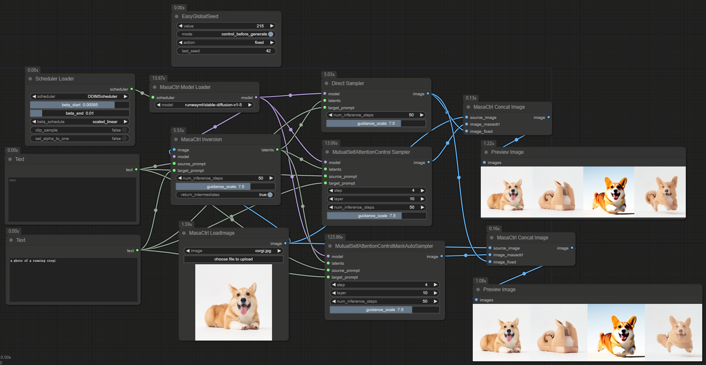

# ComfyUI nodes to use MasaCtrl

https://github.com/TencentARC/MasaCtrl

## Install

- 推荐使用管理器 ComfyUI Manager 安装（On the Way）

- 手动安装：
    1. `cd custom_nodes`
    2. `git clone https://github.com/leeguandong/ComfyUI_MasaCtrl.git`
    3. 重启 ComfyUI

## Use

- 节点：
    - MasaCtrl LoadImage: 加载图片,
    - MasaCtrl Model Loader: hf格式模型加载,
    - MasaCtrl Inversion: 图片反转,
    - MasaCtrl Concat Image: 图片合并展示,
    - Direct Sampler: 前向推理,
    - MutualSelfAttentionControl Sampler: Mutualselfattention推理,
    - MutualSelfAttentionControlMaskAuto Sampler:带有mask guidance的推理

## Stars

